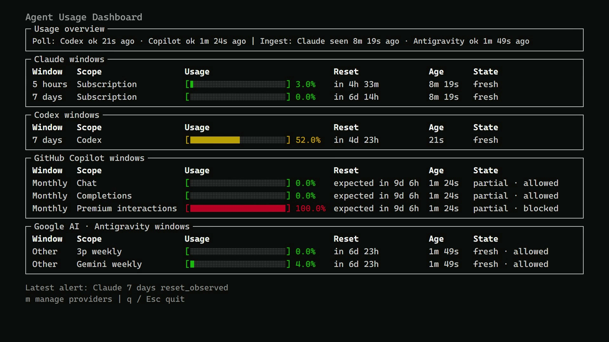

# Agent Usage Dashboard

A local terminal dashboard for Codex, Claude Code, GitHub Copilot, and Google Antigravity quota windows. It shows color-coded finite-usage bars, explicit unlimited allowances, reset times, freshness, provider health, alerts, and bounded history on Windows, macOS, and Linux.

[](https://youtu.be/9HnneSzqZnc)

[Watch the 21-second video](https://youtu.be/9HnneSzqZnc)

Privacy is a design boundary. The dashboard itself neither asks for nor intentionally reads provider credential values. It has no credential flags or configuration fields and does not open provider authentication/configuration files, keychains, or browser storage. It does not log or persist passwords, API keys, OAuth/access/refresh tokens, or cookies. Codex and Copilot authentication stay inside provider-owned local runtimes; those trusted child processes may use their own keychains or inherited authentication environment.

Claude Code and Antigravity can each supply one bounded status-line JSON value. The dashboard temporarily parses that value only to extract permit-listed quota fields, discards unrelated fields, and persists only normalized quota data to SQLite. It does not persist account identifiers, prompts, transcripts, repositories, or raw quota payloads. There is no cloud service, direct provider HTTP client, or listening ingestion server. See [Credential safety and local privacy](docs/credential-safety.md) for the complete data boundary and residual risks.

## Quick start

- Rust 1.94 or newer (the project uses Rust 2024 edition and the pinned Copilot SDK requires Rust 1.94).
- A terminal supported by Crossterm.
- For live Codex data, `codex` installed, authenticated, and available on `PATH` (or passed with `--codex-executable`).
- For Claude data, Claude Code 2.1.251 or newer and an account for which `rate_limits` is present. Claude may omit it until after the first API response or when the account is ineligible.
- For Copilot data, an active Copilot entitlement and Copilot CLI enabled by any organization that supplies it. Install the official CLI, verify `copilot --version`, then launch `copilot` and use `/login` when prompted.
- For Antigravity data, install and authenticate the official `agy` CLI, then configure its status line to invoke the dashboard. The dashboard does not support a Gemini CLI provider: Google ended consumer-tier Gemini CLI access on June 18, 2026 and directs affected individuals to Antigravity.

The pinned Copilot SDK includes a version-matched runtime. Its build script downloads and embeds the runtime and supporting assets, so first builds download more data and release artifacts are larger than a dashboard without Copilot support.

Install from the repository directory containing `Cargo.toml`, verify the installed command, and launch the dashboard:

```sh
cargo install --path .
agent-usage-dashboard --version
agent-usage-dashboard --help
agent-usage-dashboard
```

Cargo installs into its effective binary root. If the command is not found, add the exact directory printed by `cargo install` to your user `PATH`, then restart the terminal and any already-running agent process. The [installation and agent setup guide](docs/installation-and-agent-setup.md) provides executable Windows, macOS, and Linux PATH steps plus complete provider setup and verification.

The default dashboard independently polls authenticated Codex and Copilot runtimes. Verify them with `agent-usage-dashboard refresh codex` and `agent-usage-dashboard refresh copilot`, then run `agent-usage-dashboard history --limit 10`. Use `--codex-executable` only when Codex is not on the inherited `PATH`. The exact global `--copilot-runtime PATH` override is for advanced compatibility diagnostics; normal Copilot operation uses the bundled runtime.

## Commands

```text
agent-usage-dashboard [OPTIONS] [dashboard]
agent-usage-dashboard ingest claude
agent-usage-dashboard ingest antigravity
agent-usage-dashboard relay claude -- COMMAND [ARG ...]
agent-usage-dashboard relay antigravity -- COMMAND [ARG ...]
agent-usage-dashboard refresh codex [--executable PATH]
agent-usage-dashboard refresh copilot
agent-usage-dashboard watch codex [--executable PATH]
agent-usage-dashboard watch copilot
agent-usage-dashboard history [--limit 50]
agent-usage-dashboard config show
agent-usage-dashboard config save
```

With no subcommand, the dashboard opens and starts independent bounded Codex and Copilot workers (60 and 300 seconds by default). Use `--no-codex-poll` or `--no-copilot-poll` to disable either worker; use both for a fully offline dashboard. Each `refresh` command performs one read-only refresh, and each `watch` command is its non-TUI continuous form.

Global options control Codex/Copilot refresh intervals, Claude and Antigravity staleness, retention, alert thresholds, native notifications, paths, the Codex executable, and the advanced Copilot runtime override. Run `agent-usage-dashboard --help` for the complete list. Global options such as `--copilot-runtime PATH` and `--antigravity-stale-after-seconds N` appear before the subcommand.

Copilot-specific controls are `--copilot-refresh-seconds N` (60–3600, default 300), `--no-copilot-poll`, and advanced-only `--copilot-runtime PATH`. Only the cadence is persisted; disabling polling and an exact runtime path are process-local choices.

### Dashboard provider management

- `m` opens provider management.
- `Up`/`Down` or `j`/`k` selects a provider.
- `[` and `]` move the selected visible provider earlier or later among the visible panels.
- `v` hides or restores the selected provider.
- `Esc` or `m` closes provider management. Outside provider management, `Esc` exits the dashboard.
- `q` exits from either mode.

Order and visibility are local presentation preferences saved in the dashboard config and restored on later launches. Hidden providers remain in the management list at their saved relative positions. If every provider is hidden, the dashboard shows a recovery message; press `m`, select a provider, and press `v` to restore it.

Hiding a provider changes only its dashboard panel. Provider acquisition, normalized SQLite storage, alerts, notifications, and `history` continue unchanged. Use the polling flags described above when acquisition itself must be disabled.

## Configuration

`config show` prints effective TOML (persisted settings plus explicit command-line overrides). `config save` writes those effective settings. Use `--config-file PATH` to select an exact portable settings file; use the same option on every invocation that should share it.

The settings file contains only:

```toml
codex_refresh_seconds = 60
copilot_refresh_seconds = 300
claude_stale_after_seconds = 900
antigravity_stale_after_seconds = 900
retention_days = 30
low_remaining_percent = 20.0
reset_soon_seconds = 600
native_notifications = false

[provider_preferences]
order = []
hidden = []
```

Example:

```sh
agent-usage-dashboard --config-file ./dashboard.toml --retention-days 14 config save
agent-usage-dashboard --config-file ./dashboard.toml config show
```

## Claude Code status-line integration

The application never edits Claude settings. After installing the dashboard on `PATH`, add a `statusLine` entry to Claude Code's `settings.json`. For a direct dashboard status line:

```json
{
  "statusLine": {
    "type": "command",
    "command": "agent-usage-dashboard ingest claude"
  }
}
```

To preserve an existing formatter such as `ccstatusline`, use `"command": "agent-usage-dashboard relay claude -- npx -y ccstatusline@latest"` instead. The wrapped formatter's stdout, stderr, and exit status remain authoritative while ingestion is best-effort. Keep JSON escaping intact, do not put credentials or other secrets in relay arguments, and fully restart Claude Code after changing `PATH` or settings. See the [installation and agent setup guide](docs/installation-and-agent-setup.md) for settings locations, absolute-path fallbacks, portable data-directory placement, and verification steps.

## Google Antigravity status-line integration

Google ended consumer access to Gemini Code Assist through Gemini CLI on June 18, 2026 and recommends migration to Antigravity. Accordingly, this dashboard deliberately has no Gemini provider. See Google's [deprecation notice](https://developers.google.com/gemini-code-assist/docs/deprecations/code-assist-individuals) and [Gemini CLI migration guide](https://antigravity.google/docs/cli/gcli-migration/).

After installing and authenticating `agy`, run this inside Antigravity for the recommended direct status line:

```text
/statusline agent-usage-dashboard ingest antigravity
```

The command consumes one bounded JSON document and prints only a sanitized accepted/rejected bucket count. Antigravity is push-only: opening `/usage` refreshes its model quota, and the next status-line update is what the dashboard receives. There is no `refresh antigravity` or `watch antigravity` command. The separate `/credits` value is not included because the documented status payload has no machine-readable credit balance.

To preserve an existing formatter, configure `agent-usage-dashboard relay antigravity -- COMMAND [ARG ...]`. The child is launched directly without a shell; its stdout, stderr, and exit status remain authoritative. The selected formatter receives the complete original status JSON, including sensitive fields, so use only a formatter you trust. See the [setup guide](docs/installation-and-agent-setup.md) for installation, authentication, JSON configuration, PATH recovery, and safe fixture verification.

## Alerts, history, and local data

Low-remaining, reset-soon, and observed-reset alerts are deduplicated per finite quota cycle. Unlimited Copilot categories never emit low-remaining or reset-soon alerts. Terminal/TUI alerting is the default. Native desktop notifications are best-effort and opt-in with `--native-notifications` or a saved `native_notifications = true`; unsupported or headless systems continue locally.

`history --limit N` prints normalized snapshots and alert identities newest-first (1–500). Default retention is 30 days and pruning follows successful observations. `--data-dir DIR` places `usage.sqlite3` in an exact portable directory. Otherwise, config and data use the OS application directories selected by the Rust `directories` crate:

- Windows: per-user roaming config and local app-data.
- macOS: per-user Application Support locations.
- Linux: XDG config/data locations (or their standard per-user defaults).

The precise resolved default varies by OS; `--config-file` and `--data-dir` are recommended when an auditable fixed location is required. SQLite is local but is not encrypted by this application.

## Troubleshooting

- **No Codex rows:** confirm `codex --version`, its local login, and `agent-usage-dashboard refresh codex`. Use `--codex-executable /absolute/path/to/codex` if it is not on `PATH`. Provider errors retain the last good snapshot.
- **No Claude rows:** exercise Claude Code at least once, confirm its version/account emits `rate_limits`, verify the status-line command using the setup guide's PATH or absolute-path form, and confirm the status-line command and dashboard use the same `--data-dir`. Claude cannot be independently polled and becomes stale when Claude is idle.
- **No Copilot rows:** confirm `copilot --version`, launch `copilot` and complete `/login`, and confirm your organization permits Copilot CLI. Then run `agent-usage-dashboard refresh copilot`. The stable health/error classes are `spawn`, `timeout`, `not_authenticated`, `not_entitled`, `protocol`, `rpc`, and `storage`; they intentionally omit provider error bodies. Use an exact `--copilot-runtime PATH` only when diagnosing a known compatible runtime.
- **No Antigravity rows:** confirm `agy --version`, restart Antigravity after a `PATH` change, and use the dashboard's absolute executable path if necessary. Run `/usage`, then wait for the next status-line update. Confirm the status line and dashboard use the same `--data-dir`.
- **Antigravity reports `oversize` or `parse`:** the dashboard rejected input over 1 MiB or a malformed/wrong-product quota document. It never stores the raw error body. An invalid bucket can be skipped while valid siblings persist; missing or relative-only reset data is shown as partial.
- **Antigravity reports `wrapped_command`:** the trusted formatter failed or exited unsuccessfully. Run it directly, verify its path and arguments, and remember that formatter output/exit remains authoritative even when local ingestion fails.
- **Antigravity is stale or empty:** it is push-only. An empty quota observation updates health without inventing rows, and old rows naturally become stale. Run `/usage` and trigger a subsequent status-line update.
- **Copilot `/usage` differs:** the interactive `/usage` screen reports the current CLI session's statistics. The dashboard reads account-level monthly quota through the supported account-quota RPC, so the values answer different questions.
- **Stale or expired row:** this is intentional; elapsed wall time never claims a quota reset. A fresh provider observation is required.
- **Database lock/permissions:** choose a user-writable `--data-dir`. Claude ingestion uses a short busy timeout so status-line rendering is not held indefinitely.
- **No native popup:** opt in explicitly and check the desktop notification service. Terminal/TUI alerts remain available.
- **Config rejected:** unknown keys and out-of-range values fail closed. Compare the file with `config show` output.

## Verification

Local automated gates:

```sh
cargo fmt --check
cargo test
cargo build --release
cargo check
cargo clippy --all-targets -- -D warnings
cargo run -- --help
cargo run -- ingest antigravity --help
cargo run -- relay antigravity --help
cargo run -- --data-dir ./tmp-data --config-file ./tmp-config.toml config show
cargo run -- --data-dir ./tmp-data --config-file ./tmp-config.toml config save
```

Live-provider release smoke checklist (requires your authenticated local tools and must not be replaced with fixtures):

1. Run `agent-usage-dashboard refresh codex`, then open the dashboard and confirm live Codex 5-hour and weekly rows render.
2. After authenticating with Copilot CLI, run `agent-usage-dashboard refresh copilot`; confirm finite monthly categories and any `Unlimited` categories render in a GitHub Copilot panel after Codex and Claude.
3. Configure Claude's status line as above, perform a Claude request, then confirm live Claude 5-hour and weekly rows render in the same dashboard.
4. Configure Antigravity's status line, open `/usage`, cause the next status-line update, and confirm current/history/health and stale behavior. This authenticated check is advisory and remains unclaimed until a maintainer runs it.
5. Confirm ages update, values do not falsely recover after reset time, and `history --limit 10` contains only normalized quota fields.
6. Repeat with `--no-codex-poll` and `--no-copilot-poll` and confirm the corresponding provider acquisition is disabled while stored rows and push-ingested health remain visible.

Automated tests use sanitized fixtures, temporary paths, and fake clients only; they do not access authentication or use the network. Authenticated Copilot and Antigravity rendering checks remain advisory manual release gates and must not be claimed from fixture-only tests.

Do not share the SQLite database or terminal output without reviewing it; normalized timestamps and usage can still be personal operational data.

## License

MIT. See [LICENSE](LICENSE).

## Credits

- Video: made with the [`/brag`](https://github.com/latent-spaces/brag) skill and rendered with [Hyperframes](https://hyperframes.heygen.com/).
- Music: "Happy Beats / Business Moves, Vol. 11" from [ende.app](https://ende.app/en).
- Sound effects: [Kenney](https://kenney.nl/) (CC0).
